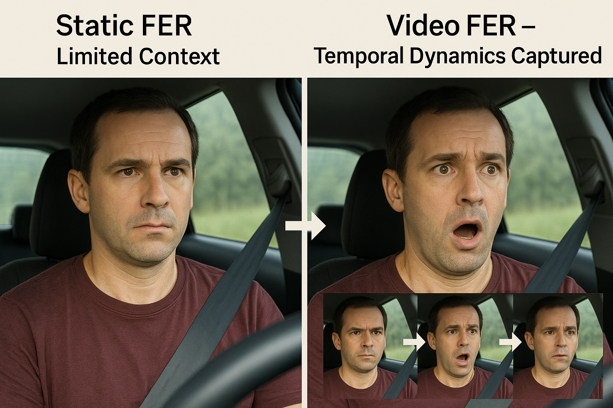
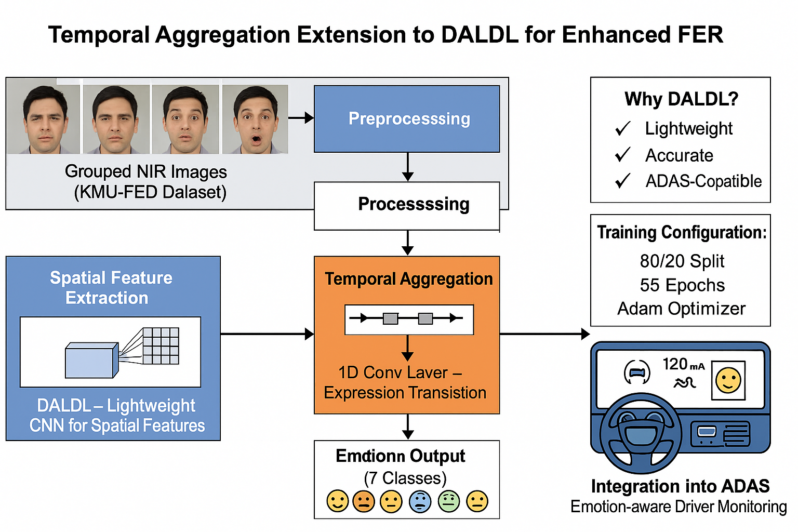
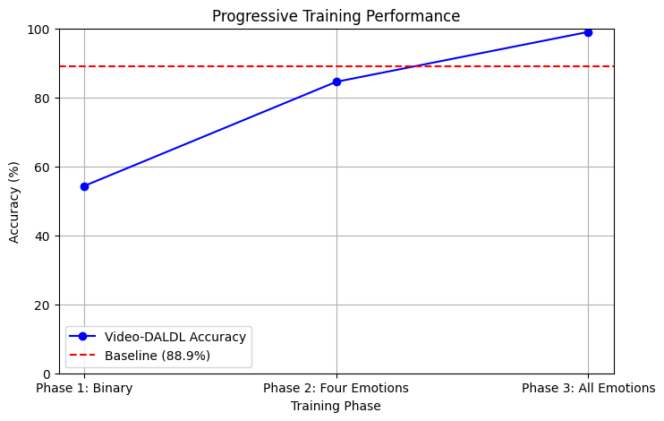

# Extending Lightweight Driver FER: A Video-Based Approach

This project explores a lightweight deep learning approach for **driver facial expression recognition (FER)** using **video-based temporal context** instead of only static images.  
The goal is to improve emotion recognition robustness for intelligent driving and driver monitoring systems.

## Project Highlights

- Lightweight FER backbone for efficient inference
- Video-sequence modeling to capture temporal expression changes
- Focus on practical driver-state understanding for ADAS-style scenarios
- Training and experimentation assets included in `Research_Implementation/`

## Static vs Video-Based FER

The comparison below shows the motivation for moving from single-frame FER to sequence-aware FER:



## Methodology

The pipeline used in this work is summarized below:



## Training Performance

Training behavior and model learning progress:



## Repository Structure

```text
.
├── README.md
├── StaticvsVideo.png
├── methodology2.png
├── Training-Graph.png
├── A Novel Lightweight Deep Learning Approach for Drivers’ Facial Expression Detection.pdf
└── Research_Implementation/
    ├── FED-Driver.ipynb
    ├── First perfect test.ipynb
    ├── researchmodule-trial1.py
    ├── KMU_FED_DATASET/
    └── kmu_fed/
```

## Implementation Notes

- Main experimental code is in:
  - `Research_Implementation/researchmodule-trial1.py`
  - `Research_Implementation/FED-Driver.ipynb`
- The implementation includes a lightweight convolutional design and attention modules for FER.
- Dataset folders under `Research_Implementation/` are used for training/validation workflows.

## Getting Started

1. Open the notebooks or Python script in `Research_Implementation/`.
2. Install required dependencies (PyTorch, TorchVision, OpenCV, scikit-learn, matplotlib, Pillow, tqdm).
3. Configure dataset paths according to your local environment.
4. Run training and evaluation cells/scripts.

## Citation / Reference

If you use this repository, please cite the related manuscript included in this project:

- `A Novel Lightweight Deep Learning Approach for Drivers’ Facial Expression Detection.pdf`
